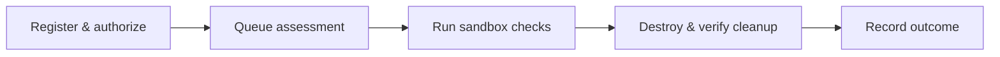

  

<h1 align="center">SEIRETH</h1>

Authorized security checks. Disposable environments. Verified cleanup.

  
  
  
  

SEIRETH runs bounded security assessments against authorized containerized
targets, records findings and audit events, and destroys the assessment
environment afterward.

**MVP-0:** a working local API with one passive HTTP security-header plugin.
It uses PostgreSQL 18, versioned Alembic migrations, and a process-local worker. It is not a multi-user production
service or a general internet scanner.

## How it works

- **Bounded requests:** project, target, origin, path, and expiry checks.
- **Operator-controlled images:** requests select only allowlisted target images.
- **Disposable Docker resources:** a private network, restricted target, and runner.
- **Queryable outcomes:** JSON findings, cleanup status, and an audit trail.

## Getting started

Follow [the setup guide](docs/getting-started.md) for Python 3.14, PostgreSQL,
and native or Docker startup. The default in-memory backend simulates responses;
real assessments require Docker and access to its privileged socket.

After setup, `python -m app verify` exercises project registration, authorization,
assessment execution, results, cleanup, and audit ordering. See [Assessments](docs/assessments.md)
for API states and cancellation, and [Contributing](CONTRIBUTING.md) for development checks.

## Documentation

| Guide | What it covers |
| --- | --- |
| [Getting started](docs/getting-started.md) | Setup, verification, and troubleshooting |
| [Architecture](docs/architecture.md) | Current components and data flow |
| [Configuration](docs/configuration.md) | Settings, defaults, and image policy |
| [Assessments](docs/assessments.md) | Requests, polling, cancellation, and results |
| [Security model](docs/security-model.md) | Isolation boundaries and limitations |
| [Roadmap](docs/roadmap.md) | Implemented capabilities and future work |

Use only targets you are authorized to assess. Report SEIRETH vulnerabilities
through the process in [SECURITY.md](SECURITY.md).

Licensed under [Apache 2.0](LICENSE). The logo is reused from the
[SEIRETH GitHub organization](https://github.com/seireth).
