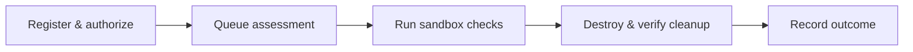

  

<h1 align="center">SEIRETH</h1>

Authorized security checks. Disposable environments. Verified cleanup.

  
  
  
  

SEIRETH runs authorized HTTP security checks against disposable containers,
stores findings and audit events, and verifies sandbox cleanup. Docker assessments
inspect a new instance of an approved image, not the original remote host.

**MVP-0:** a local API with one passive security-header plugin and PostgreSQL 18
persistence. It is not a multi-user production service or general internet scanner.

## How it works

Requests are bounded by project, target, origin, path, expiry, and an operator
image allowlist. Docker provides a private network, restricted target, and runner;
the API exposes JSON findings, cleanup status, and audit events.

## Getting started

Follow [Getting started](docs/getting-started.md) for Python 3.14 and PostgreSQL
setup. The example configuration selects `inmemory`, which simulates responses.
Real checks require Docker and API access to its privileged socket.

## Documentation

| Guide | Purpose |
| --- | --- |
| [Getting started](docs/getting-started.md) | Run, verify, stop, and troubleshoot |
| [Configuration](docs/configuration.md) | Required settings, defaults, and Compose overrides |
| [Assessments](docs/assessments.md) | Submit requests and interpret results |
| [Architecture](docs/architecture.md) | Understand execution, persistence, and recovery |
| [Plugin development](docs/plugins.md) | Add approved checks |
| [Security model](docs/security-model.md) | Understand boundaries and investigate cleanup |
| [Roadmap](docs/roadmap.md) | Future priorities and directions |
| [Contributing](CONTRIBUTING.md) | Develop, test, and change schemas |

Use only authorized targets. Report vulnerabilities through [SECURITY.md](SECURITY.md).
Licensed under [Apache 2.0](LICENSE).
