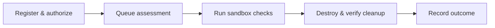

<p align="center">
  
</p>

<h1 align="center">SEIRETH</h1>

<p align="center">Authorized security checks. Disposable environments. Verified cleanup.</p>

<p align="center">
  <a href="https://github.com/seireth/seireth/actions/workflows/ci.yml"></a>
  <a href="https://github.com/seireth/seireth/actions/workflows/security.yml"></a>
  <a href="https://www.python.org/downloads/"></a>
  <a href="LICENSE"></a>
</p>

SEIRETH runs bounded security assessments against authorized containerized
targets, records findings and audit events, and destroys the assessment
environment afterward.

**MVP-0:** a working local API with one passive HTTP security-header plugin.
It uses PostgreSQL 18, versioned Alembic migrations, and a process-local worker. It is not a multi-user production
service or a general internet scanner.

## How it works



- **Bounded requests:** project, target, origin, path, and expiry checks.
- **Operator-controlled images:** requests select only allowlisted target images.
- **Disposable Docker resources:** a private network, restricted target, and runner.
- **Queryable outcomes:** JSON findings, cleanup status, and an audit trail.

## Quick start

Install **Python 3.14**. Create and activate a virtual environment:

**Windows PowerShell**

```powershell
py -3.14 -m venv .venv
.\.venv\Scripts\Activate.ps1
Copy-Item .env.example .env
```

**macOS / Linux**

```bash
python3.14 -m venv .venv
source .venv/bin/activate
cp .env.example .env
```

Install and start the API:

```bash
python -m pip install -e ".[test,quality,security]"
docker compose up -d postgres
python -m app migrate
python -m app serve
```

Open [the API explorer](http://127.0.0.1:8000/docs). In a second terminal with
the same virtual environment activated, run:

```bash
python -m app verify --expected-backend inmemory
```

The default `inmemory` backend **simulates header responses without network
access**. It verifies the API workflow; it does not assess a real website.

For a fully Docker-free setup, use native PostgreSQL and the simulated backend:
[Docker-free development](docs/getting-started.md#development-without-docker).

## Run a real Docker assessment

With Docker Desktop or Docker Engine running, stop the local API to free port
8000. Keep the `.env` file created above, then run:

```bash
docker build -t seireth/demo-target:local examples/demo-target
docker pull python:3.14-slim
python -m app docker-up
python -m app verify --expected-backend docker --timeout-seconds 120
```

`python -m app docker-up` starts PostgreSQL, applies migrations in a temporary
container that removes itself, and starts the Docker-backed API only on success.
PostgreSQL records persist in a named volume. The API uses the host Docker socket, which grants substantial host
control; see the [security model](docs/security-model.md).

A successful demo produces this result shape (timestamp varies):

```json
{
  "plugin": "security-headers",
  "finding_count": 3,
  "sandbox_backend": "docker",
  "cleanup_verified": true,
  "completed_at": "2026-09-17T12:00:00+00:00"
}
```

Stop the API with `docker compose down`. Assessment resources are removed by
the worker; the database volume remains for subsequent use.

## Understanding assessment responses

Creation returns `202 Accepted` because work runs in the background. An initial
`result: null` means no execution outcome has been recorded yet. Follow the
`Location` response header to poll the assessment; append `/results` for findings.

Stop polling at `completed`, `failed`, or `cancelled`. A completed assessment
has a result even when it finds zero issues. An assessment cancelled before
execution may retain a null result. See [the API walkthrough](docs/assessments.md).

## Development

```bash
python -m pytest
python -m ruff check .
python -m ruff format --check .
```

Set `SEIRETH_TEST_ADMIN_URL` as shown in [Getting started](docs/getting-started.md)
before running database tests. Tests create and drop an isolated PostgreSQL database.
CI runs on Python
3.14 and also checks real Docker completion, cancellation, and crash recovery. See
[Contributing](CONTRIBUTING.md) for formatting and dependency-audit commands.

## Documentation

| Guide | What it covers |
| --- | --- |
| [Getting started](docs/getting-started.md) | Setup, verification, and troubleshooting |
| [Architecture](docs/architecture.md) | Current components and data flow |
| [Configuration](docs/configuration.md) | Settings, defaults, and image policy |
| [Assessments](docs/assessments.md) | Requests, polling, cancellation, and results |
| [Security model](docs/security-model.md) | Isolation boundaries and limitations |
| [Roadmap](docs/roadmap.md) | Implemented capabilities and future work |

Use only targets you are authorized to assess. Report SEIRETH vulnerabilities
through the process in [SECURITY.md](SECURITY.md).

Licensed under [Apache 2.0](LICENSE). The logo is reused from the
[SEIRETH GitHub organization](https://github.com/seireth).
