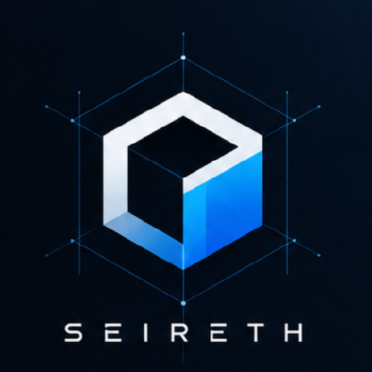
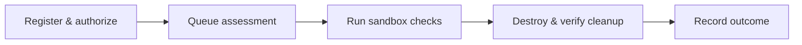

  

<h1 align="center">SEIRETH</h1>

Authorized security checks. Disposable environments. Verified cleanup.

  
  
  
  

  
  

SEIRETH is a local, single-operator GUI and API for passive HTTP header and cookie
security checks. Docker assessments inspect disposable instances of approved
images. Findings, evidence, and audit events are stored in PostgreSQL 18, and
SEIRETH verifies cleanup after execution.

## How it works

```mermaid
flowchart LR
    A[Register & authorize] --> B[Queue assessment]
    B --> C[Run sandbox checks]
    C --> D[Destroy & verify cleanup]
    D --> E[Record outcome]
```

Scopes bound requests by project, target, origin, path, and expiry. An operator
image allowlist restricts image selection; Docker provides a private network,
restricted target, and runner.

## Checks

| Workflow                                                                            | Checks                                                                                      |
| ----------------------------------------------------------------------------------- | ------------------------------------------------------------------------------------------- |
| [CI](https://github.com/seireth/seireth/actions/workflows/ci.yml)                   | Repository checks, Python quality, Frontend quality, Dependency review (pull requests only) |
| [Build](https://github.com/seireth/seireth/actions/workflows/build.yml)             | Tests, coverage and SonarQube                                                               |
| [Integration](https://github.com/seireth/seireth/actions/workflows/integration.yml) | Docker assessment lifecycle, including browser and packaged-asset checks                    |

## Getting started

Follow [Getting started](docs/getting-started.md) for setup and startup commands.
The example configuration selects `inmemory`, which simulates responses. Real
checks require Docker and API access to its privileged socket. Open `/dashboard/`
on the API address to use the GUI.

## Documentation

| Guide                                      | Purpose                                            |
| ------------------------------------------ | -------------------------------------------------- |
| [Getting started](docs/getting-started.md) | Run, verify, stop, and troubleshoot                |
| [Configuration](docs/configuration.md)     | Required settings, defaults, and Compose overrides |
| [Assessments](docs/assessments.md)         | Submit requests and interpret results              |
| [Architecture](docs/architecture.md)       | Understand execution, persistence, and recovery    |
| [Plugin development](docs/plugins.md)      | Add approved checks                                |
| [Security model](docs/security-model.md)   | Understand boundaries and investigate cleanup      |
| [Roadmap](docs/roadmap.md)                 | Future priorities and directions                   |
| [Contributing](CONTRIBUTING.md)            | Develop, test, and change schemas                  |

Use only authorized targets. Report vulnerabilities through [SECURITY.md](SECURITY.md).
Licensed under [Apache 2.0](LICENSE).
